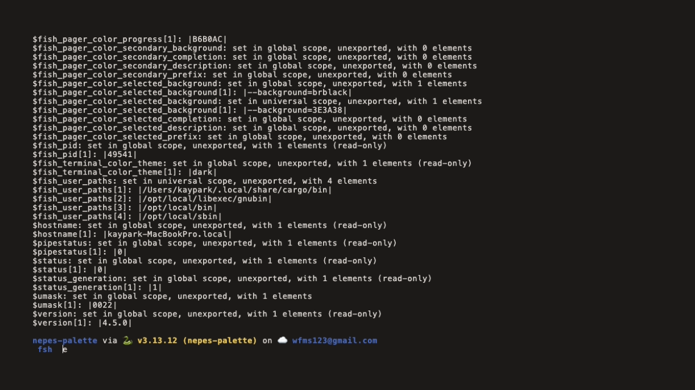
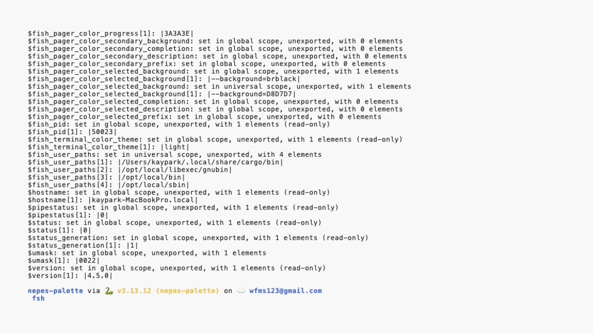

#+title: fish-nepes
#+description: Nepes color theme for fish

Fish shell color theme.

Part of the [[https://github.com/kayspark][Nepes Colorscheme]] suite.

* Screenshots

| Dark | Light |
|------+-------|
|  |  |

* Installation

1. Clone this repo
2. Source the theme:
#+begin_src shell
source /path/to/fish-nepes/nepes-dark.fish
#+end_src

* Related

- [[https://github.com/kayspark/nepes-palette][nepes-palette]] — single source of truth for all Nepes themes
- [[https://github.com/kayspark/starship-nepes][starship-nepes]] — prompt palette displayed inside fish shell
- [[https://github.com/kayspark/fzf-nepes][fzf-nepes]] — fuzzy finder used within fish shell

* Credits

Generated by [[https://github.com/kayspark/nepes-palette][nepes-palette]].
